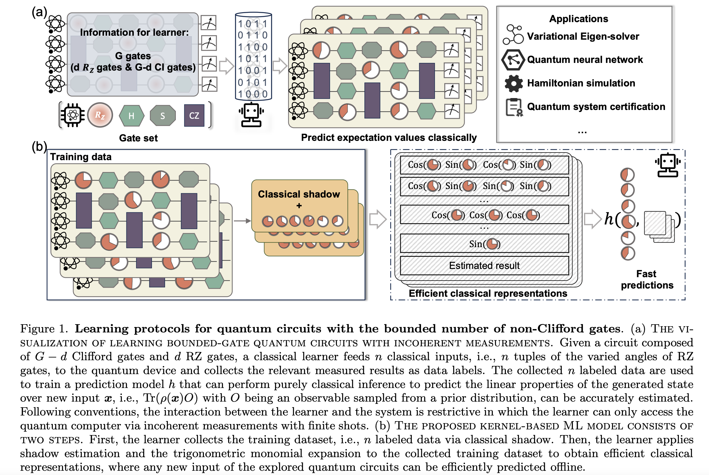
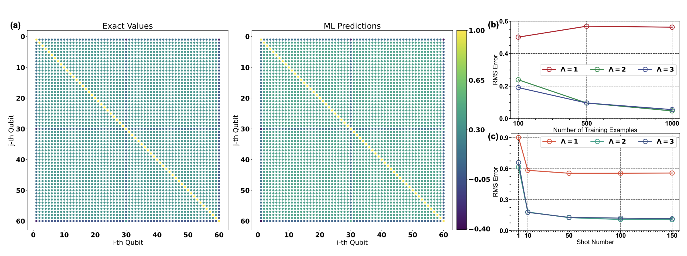
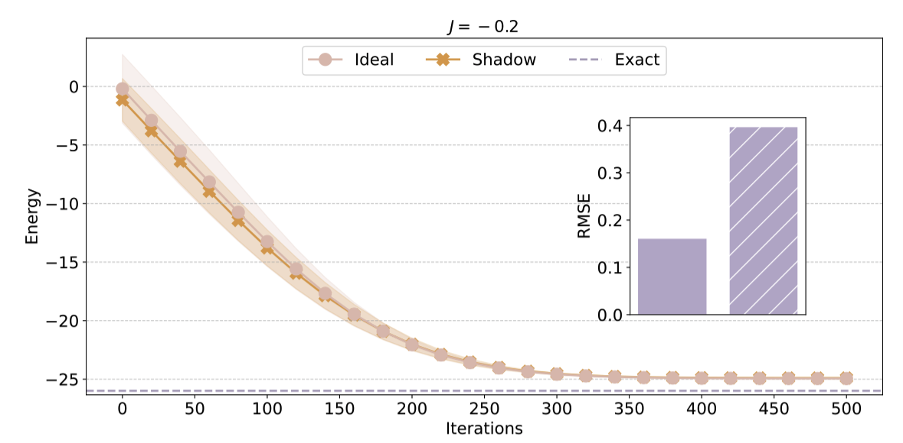

# **Efficient Learning for Linear Properties of Bounded-Gate Quantum Circuits**
This repository provides the source code for our work “Efficient Learning for Linear Properties of Bounded-Gate Quantum Circuits” [](https://arxiv.org/pdf/2408.12199). Our approach leverages **classical shadows** and **compact representations of input configurations** to balance **prediction accuracy and computational efficiency**. We validate the effectiveness of this framework across diverse quantum applications, including **quantum information processing, Hamiltonian simulation, and variational quantum algorithms (VQAs)** with up to **60 qubits**.





## **Overview**
Predicting the behavior of large-scale quantum circuits is essential for advancing quantum computing and understanding quantum systems. However, the extent to which **classical learners** can infer linear properties of quantum circuits from measurement data remains an open question. This repository implements:
- **A kernel-based learning framework** designed for efficient inference of bounded-gate quantum circuits.
- **Theoretical guarantees on sample complexity**, demonstrating linear scaling with tunable gate count while computational costs may grow exponentially.
- **Optimized pretraining strategies** for **variational quantum eigensolvers (VQEs)**, enabling resource-efficient quantum system certification.

## **Requirements**

numpy>=1.21.0
scipy>=1.7.0
scikit-learn>=1.0.0
optax>=0.1.3
jax>=0.3.0
joblib>=1.1.0


## **Usage**
### **1. Predicting two-point correlation of 50-qubit circuit** (Fig 2)



The source code is avaiable at the folder "Pretrain-50-qubit-TFIM"

Please first download the dataset at https://drive.google.com/drive/folders/1lzDyZ7d3Wsm2ncFMGhkUjJg7HrI3ouXy?usp=drive_link

Then run the pretraining script for two-point correlation estimation for different qubit pairs:

```python 
python GHZ_two_point_correlation_predict.py
```


### **2. Pretraining VQE for 50-qubit TFIM** (Fig. 3b)



The source code is provided in the folder 'Pretrain-60-qubit-TFIM'

Run the pretraining script for TFIM Hamiltonians:

```python 
python pre_train_50-qubit_tfim_benchmark.py
```


## **Benchmarks**
We compare our method against **LOWESA** and **other classical simulators**, demonstrating advantages in **runtime efficiency** and **robustness to quantum noise**. Detailed benchmarking results are available in the **Benchmarking** section of our paper.

## **Citation**
If you find this work useful, please consider citing:
```bibtex
@article{du2024efficient,
  title={Efficient learning for linear properties of bounded-gate quantum circuits},
  author={Du, Yuxuan and Hsieh, Min-Hsiu and Tao, Dacheng},
  journal={arXiv preprint arXiv:2408.12199},
  year={2024}
}
```

## **License**
This project is released under the **MIT License**.
